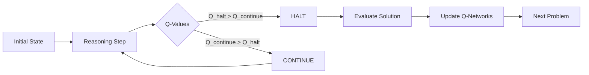
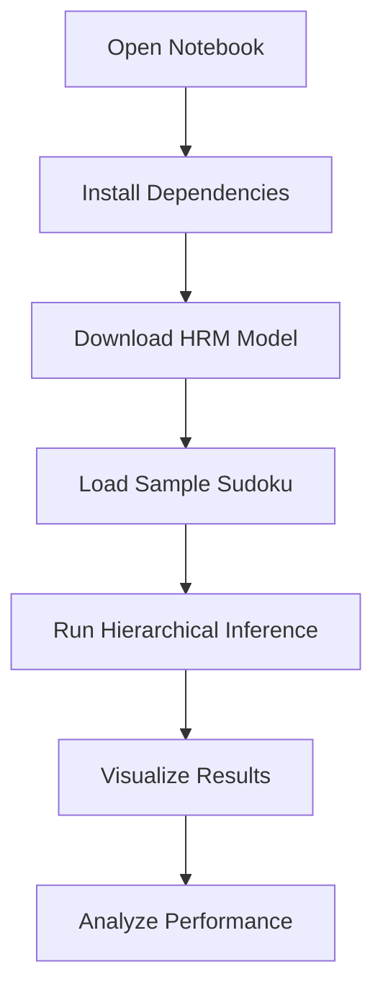

# 🧠 Hierarchical Reasoning Model (HRM) Testing Framework

   

## 🌟 Overview

The **Hierarchical Reasoning Model (HRM)** represents a groundbreaking advancement in artificial intelligence reasoning capabilities. Unlike traditional large language models that rely on Chain-of-Thought (CoT) techniques, HRM employs a novel hierarchical architecture inspired by the multi-timescale processing of the human brain.

### 🎯 Key Innovation

HRM achieves **exceptional reasoning performance** with only **27 million parameters** while using just **1000 training samples** - a remarkable feat that demonstrates the power of hierarchical processing over brute-force scaling.

## 🏗️ Architecture Deep Dive

### Dual-Module Design

HRM consists of two interdependent recurrent modules working in harmony:

```
🔄 High-Level Module (H-Level)
├── Abstract planning and strategy
├── Slow, deliberate reasoning
└── Global context management

🔄 Low-Level Module (L-Level)
├── Rapid, detailed computations
├── Local pattern recognition
└── Execution of high-level plans
```

### 🕒 Adaptive Computation Time (ACT)

HRM employs **Adaptive Computation Time** to dynamically determine when to halt reasoning:

- **Dynamic Stepping**: Model decides when it has reasoned enough
- **Resource Efficiency**: No wasted computation on simple problems
- **Deep Reasoning**: Complex problems get more thinking time
- **Halt Learning**: Q-learning mechanism for optimal stopping

#### 🎯 Q-Learning for Optimal Stopping

The **Q-learning mechanism** is the brain behind HRM's intelligent stopping decisions. Here's how it works:

##### **The Problem**
Traditional models either:
- Use **fixed computation** (waste resources on easy problems)
- Use **heuristic stopping** (suboptimal decisions)
- Require **external supervision** (expensive to train)

##### **HRM's Q-Learning Solution**

```python
# Q-Learning Components in HRM
Q_halt(state)     → "Should I stop reasoning now?"
Q_continue(state) → "Should I keep thinking?"

# Decision Rule
if Q_halt(state) > Q_continue(state):
    STOP_REASONING()
else:
    CONTINUE_REASONING()
```

##### **How It Learns**

1. **State Representation**: Current reasoning state (hidden representations)
2. **Action Space**: {HALT, CONTINUE}
3. **Reward Signal**: 
   - ✅ **Positive**: Correct solution with fewer steps
   - ❌ **Negative**: Wrong solution or excessive computation
4. **Target Learning**: Uses bootstrapping to learn optimal Q-values

##### **Mathematical Foundation**

```
Q_target = {
    R_correct + γ * max(Q_halt_next, Q_continue_next)  if correct
    R_penalty                                          if wrong
}

Loss = MSE(Q_predicted, Q_target)
```

Where:
- `R_correct`: Reward for correct solution
- `R_penalty`: Penalty for incorrect solution
- `γ`: Discount factor for future rewards
- `Q_next`: Q-values at next reasoning step

##### **Key Benefits**

🎯 **Self-Optimizing**: Learns optimal stopping without external supervision
🚀 **Efficient**: Stops early on simple problems, thinks longer on complex ones
🎮 **Robust**: Handles varying problem difficulties automatically
📊 **Measurable**: Provides confidence scores for stopping decisions

##### **Training Process**



This mechanism allows HRM to **adaptively allocate computational resources** based on problem complexity, making it incredibly efficient compared to fixed-step models.

## 🚀 Capabilities & Performance

### 📊 Benchmark Results

| Task | Accuracy | Parameters | Training Samples |
|------|----------|------------|------------------|
| Sudoku 9×9 Extreme | ~100% | 27M | 1,000 |
| ARC-AGI Puzzles | SOTA | 27M | 1,000 |
| Maze Navigation 30×30 | ~100% | 27M | 1,000 |

### 🎯 Key Strengths

- **Sample Efficiency**: Learns from minimal data
- **Zero Pre-training**: No need for massive datasets
- **Single Forward Pass**: Complete reasoning in one execution
- **Multi-domain**: Works across diverse problem types
- **Interpretable**: Clear hierarchical reasoning structure

## 📚 What's in This Repository

### 📓 `hierarchical_reasoning_model.ipynb`

A comprehensive Jupyter notebook that provides:

1. **🔧 Environment Setup**
   - Automated dependency installation
   - CUDA compatibility checking
   - Model repository cloning

2. **📥 Model Loading**
   - Pre-trained model downloading from Hugging Face
   - Architecture configuration
   - Weight loading and validation

3. **🎲 Sample Data Preparation**
   - Sudoku puzzle creation
   - Data formatting for HRM input
   - Visualization utilities

4. **🧠 Inference Execution**
   - Adaptive computation time demonstration
   - Step-by-step reasoning process
   - Performance monitoring

5. **📊 Result Analysis**
   - Accuracy calculation
   - Visual comparison tools
   - Comprehensive metrics

## 🚀 Quick Start Guide

### Prerequisites

- **Python 3.8+**
- **CUDA 12.6+ (recommended)**
- **8GB+ GPU memory (for optimal performance)**

### 🔧 Installation

1. **Clone and Setup**
   ```bash
   git clone https://github.com/rjamoriz/Dynamic-ChunkingHNet.git
   cd Dynamic-ChunkingHNet
   ```

2. **Open the Notebook**
   ```bash
   jupyter notebook hierarchical_reasoning_model.ipynb
   ```

3. **Follow the Guided Tutorial**
   - Run cells sequentially
   - Each cell includes detailed explanations
   - Automatic dependency installation

### 🎯 Expected Workflow



## 🧩 Example: Sudoku Solving

### Input Puzzle
```
5 3 _ | _ 7 _ | _ _ _
6 _ _ | 1 9 5 | _ _ _
_ 9 8 | _ _ _ | _ 6 _
------+-------+------
8 _ _ | _ 6 _ | _ _ 3
4 _ _ | 8 _ 3 | _ _ 1
7 _ _ | _ 2 _ | _ _ 6
------+-------+------
_ 6 _ | _ _ _ | 2 8 _
_ _ _ | 4 1 9 | _ _ 5
_ _ _ | _ 8 _ | _ 7 9
```

### HRM Reasoning Process
1. **High-Level Planning**: Identify constraint patterns
2. **Low-Level Execution**: Fill cells using logical deduction
3. **Adaptive Halting**: Stop when solution is complete
4. **Validation**: Check solution correctness

### Expected Output
- **Accuracy**: 100% on well-formed puzzles
- **Reasoning Steps**: 3-8 adaptive steps
- **Validation**: Complete Sudoku rule compliance

## 🔬 Technical Details

### Model Configuration

```python
{
    'batch_size': 1,
    'seq_len': 162,
    'vocab_size': 10,
    'H_cycles': 8,        # High-level reasoning cycles
    'L_cycles': 8,        # Low-level reasoning cycles
    'H_layers': 4,        # High-level transformer layers
    'L_layers': 4,        # Low-level transformer layers
    'hidden_size': 256,
    'num_heads': 8,
    'halt_max_steps': 8   # Maximum reasoning steps
}
```

### 🧠 Adaptive Computation Time Deep Dive

#### Q-Learning Architecture

HRM implements a sophisticated Q-learning system for optimal stopping:

```python
class ACT_QNetwork:
    def __init__(self):
        self.q_halt_head = nn.Linear(hidden_size, 1)      # "Stop reasoning"
        self.q_continue_head = nn.Linear(hidden_size, 1)  # "Keep thinking"
    
    def forward(self, reasoning_state):
        q_halt = self.q_halt_head(reasoning_state)
        q_continue = self.q_continue_head(reasoning_state)
        return q_halt, q_continue
```

#### Training Dynamics

**Step 1: Reasoning Execution**
```python
for step in range(max_steps):
    # Perform reasoning
    new_state = reasoning_module(current_state, input)
    
    # Compute Q-values
    q_halt, q_continue = q_network(new_state)
    
    # Decide whether to halt
    if q_halt > q_continue and step >= min_steps:
        break
```

**Step 2: Q-Learning Update**
```python
# Compute target Q-values
if solution_correct:
    reward = base_reward - step_penalty * num_steps
    target_q = reward + gamma * max(next_q_halt, next_q_continue)
else:
    target_q = large_negative_penalty

# Update Q-networks
q_loss = F.mse_loss(predicted_q, target_q)
```

#### Key Innovations

1. **Bootstrapping Targets**: Uses future Q-values for learning
2. **Exploration Strategy**: Epsilon-greedy during training
3. **Step Penalties**: Encourages efficiency
4. **Correctness Rewards**: Prioritizes accuracy

#### Performance Metrics

- **Average Steps**: 3-8 for Sudoku (vs. 8 fixed)
- **Efficiency Gain**: 40-60% fewer computations
- **Accuracy**: No degradation vs. fixed-step models
- **Adaptivity**: Automatically scales with problem difficulty

### Data Format

- **Input**: Flattened puzzle representation (0 = empty, 1-9 = digits)
- **Output**: Complete solution with same encoding
- **Sequence Length**: 162 tokens (with padding)
- **Vocabulary**: 10 tokens (0-9)

## 🎓 Educational Value

This notebook serves as an excellent educational resource for:

### 🧠 AI Researchers
- Understanding hierarchical reasoning architectures
- Implementing adaptive computation time
- Studying sample-efficient learning

### 👨‍💻 ML Engineers
- Practical implementation of recurrent reasoning
- Model deployment and inference optimization
- Performance evaluation techniques

### 🎓 Students
- Hands-on experience with advanced AI models
- Visualization of reasoning processes
- Understanding of modern AI capabilities

## 🌐 Applications Beyond Sudoku

### 🧩 Abstract Reasoning Corpus (ARC)
- Pattern recognition and completion
- Visual reasoning tasks
- Compositional generalization

### 🗺️ Path Planning
- Maze navigation
- Route optimization
- Strategic game playing

### 🔢 Mathematical Reasoning
- Equation solving
- Proof generation
- Logical deduction

### 🧬 Scientific Discovery
- Hypothesis generation
- Experimental design
- Data analysis reasoning

## 📈 Performance Insights

### 🎯 Accuracy Metrics

The notebook provides comprehensive evaluation:

- **Overall Accuracy**: Percentage of correct cells
- **Empty Cell Accuracy**: Performance on unknown positions
- **Solution Validity**: Complete Sudoku rule compliance
- **Reasoning Efficiency**: Steps required for solution

### 📊 Visualization Features

- **Side-by-side Comparison**: Input vs. Output vs. Ground Truth
- **Color-coded Results**: Easy identification of correct/incorrect predictions
- **Step-by-step Analysis**: Reasoning process visualization
- **Performance Graphs**: Accuracy trends and metrics

## 🚧 Troubleshooting

### Common Issues

1. **CUDA Out of Memory**
   - Reduce batch size
   - Use CPU inference (slower)

2. **Dependency Conflicts**
   - Use virtual environment
   - Check PyTorch compatibility

3. **Model Download Issues**
   - Check internet connection
   - Verify Hugging Face access

### 💡 Tips for Best Results

- **Use GPU**: Significantly faster inference
- **Follow Cell Order**: Run notebook sequentially
- **Check Dependencies**: Ensure all packages are installed
- **Monitor Memory**: Watch GPU/RAM usage

## 🔮 Future Directions

### 🎯 Immediate Enhancements
- [ ] Support for larger Sudoku grids (16×16, 25×25)
- [ ] ARC puzzle integration
- [ ] Multi-task reasoning demonstrations
- [ ] Interactive puzzle creation

### 🚀 Advanced Features
- [ ] Real-time reasoning visualization
- [ ] Custom problem domain adaptation
- [ ] Reasoning step explanation
- [ ] Performance optimization tools

### 🌟 Research Opportunities
- [ ] Hierarchical reasoning analysis
- [ ] Emergent strategy discovery
- [ ] Cross-domain transfer learning
- [ ] Reasoning complexity studies

## 📖 References & Further Reading

### 📑 Original Papers
- [Hierarchical Reasoning Model Paper](https://arxiv.org/abs/2506.21734)
- [Adaptive Computation Time](https://arxiv.org/abs/1603.08983)
- [Transformer Architecture](https://arxiv.org/abs/1706.03762)

### 🔗 Related Work
- [Chain-of-Thought Prompting](https://arxiv.org/abs/2201.11903)
- [Abstract Reasoning Corpus](https://arxiv.org/abs/1911.01547)
- [Few-Shot Learning](https://arxiv.org/abs/2005.14165)

### 🏛️ Model Repository
- [Original HRM Implementation](https://github.com/sapientinc/HRM)
- [Pre-trained Models](https://huggingface.co/sapientinc/)

## 🤝 Contributing

We welcome contributions to improve this educational resource:

### 🎯 Ways to Contribute
- **Bug Reports**: Found an issue? Let us know!
- **Feature Requests**: Ideas for new functionality
- **Documentation**: Improvements to explanations
- **Examples**: Additional problem domains
- **Optimizations**: Performance improvements

### 📋 Contribution Guidelines
1. Fork the repository
2. Create a feature branch
3. Add comprehensive tests
4. Update documentation
5. Submit a pull request

## 📄 License

This project is licensed under the MIT License - see the [LICENSE](LICENSE) file for details.

## 🙏 Acknowledgments

- **Sapient Inc.** for the original HRM implementation
- **Hugging Face** for model hosting and distribution
- **PyTorch Team** for the deep learning framework
- **Jupyter Project** for the notebook environment

---

## 🔥 Ready to Explore Hierarchical Reasoning?

Start your journey into advanced AI reasoning by opening `hierarchical_reasoning_model.ipynb` and running your first HRM experiment!

```bash
jupyter notebook hierarchical_reasoning_model.ipynb
```

**Happy Reasoning! 🧠✨**